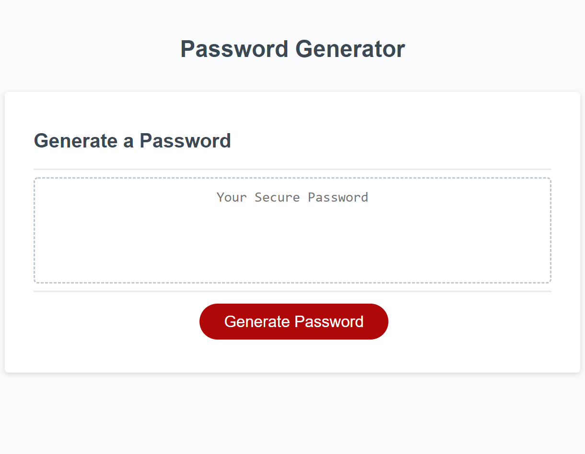

# Title: # 03-PasswordGenerator-Dan-Aument-UT-Homework

## Table of Contents:
* [Description](#Description)
* [Screenshot](#Screenshot)
* [Location of Deployed Project](#Location)
* [Notes from Dan](#Notes)
* [Credits](#Credits)
* [License](#License)

### <a name="Description">Description:</a>
This project serves as a homework assignment submission for the third week of UT's web dev coding bootcamp.  It contains a codebase and a deployed webpage for a password generator.

### <a name="Screenshot">Screenshot: </a>

### <a name="Location">Location of Deployed Project:</a>
https://danaument.github.io/PasswordGenerator/

### <a name="Notes">Notes from Dan:  </a>

This project was my third assignment for my web dev bootcamp.  It contains my first major foray into Javascript.

This was the first assignment for which I completed ample pseudocode.  I know that Javascript will be hugely important almost everywhere, but figuring out the process of moving from requirements to pseudocode to code with line-by-line testing will probably be the biggest lesson I learned from this assignment.

I was able to satisfy the requirements of the assignment early in the week and decided to add a feature.  In most real world scenarios, web apps often both allow and *require* the use of special characters and numbers.  I wanted my password generator to not only use those characters but to also make certain that the resulting password included at least one of each type that the user selected.  I nested my password generating function in a do/while loop with a condition that I was able to cobble together from examples I found on the web.  

During the course of developing this project, I used probably 40 console.log() lines.  Per the recommendation of one of my class TAs, I have removed all but one.  **Open the console** to few the components of the while condition.  

### <a name="Credits">Credits: </a>
This project was completed by Dan Aument with help from his tutor, Leah Nelson, using code and assets provided by The Coding Boot Camp at UT Austin in partnership with Trilogy Education Services.  

I made use of this Stack Overflow discussion: https://stackoverflow.com/questions/1885557/simplest-code-for-array-intersection-in-javascript.

### <a name="License">License: </a>

Distributed under the MIT License

MIT License

Copyright (c) 2020 Daniel Aument

Permission is hereby granted, free of charge, to any person obtaining a copy
of this software and associated documentation files (the "Software"), to deal
in the Software without restriction, including without limitation the rights
to use, copy, modify, merge, publish, distribute, sublicense, and/or sell
copies of the Software, and to permit persons to whom the Software is
furnished to do so, subject to the following conditions:

The above copyright notice and this permission notice shall be included in all
copies or substantial portions of the Software.

THE SOFTWARE IS PROVIDED "AS IS", WITHOUT WARRANTY OF ANY KIND, EXPRESS OR
IMPLIED, INCLUDING BUT NOT LIMITED TO THE WARRANTIES OF MERCHANTABILITY,
FITNESS FOR A PARTICULAR PURPOSE AND NONINFRINGEMENT. IN NO EVENT SHALL THE
AUTHORS OR COPYRIGHT HOLDERS BE LIABLE FOR ANY CLAIM, DAMAGES OR OTHER
LIABILITY, WHETHER IN AN ACTION OF CONTRACT, TORT OR OTHERWISE, ARISING FROM,
OUT OF OR IN CONNECTION WITH THE SOFTWARE OR THE USE OR OTHER DEALINGS IN THE
SOFTWARE.
